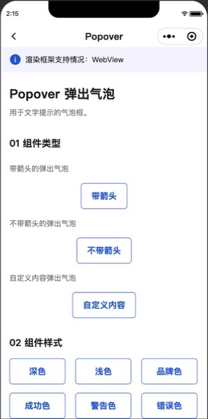
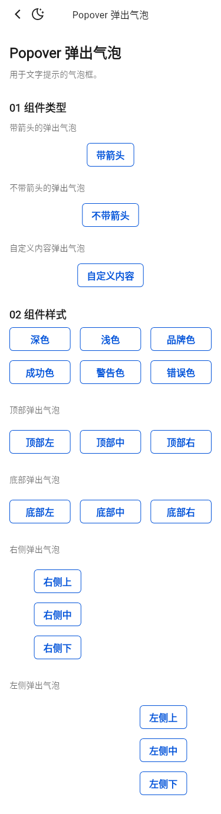
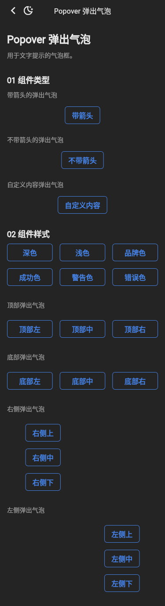
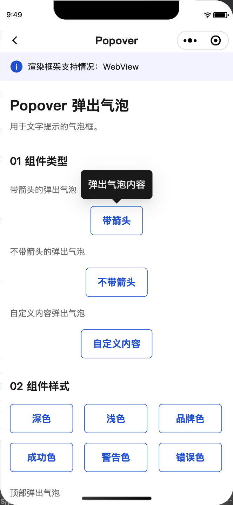
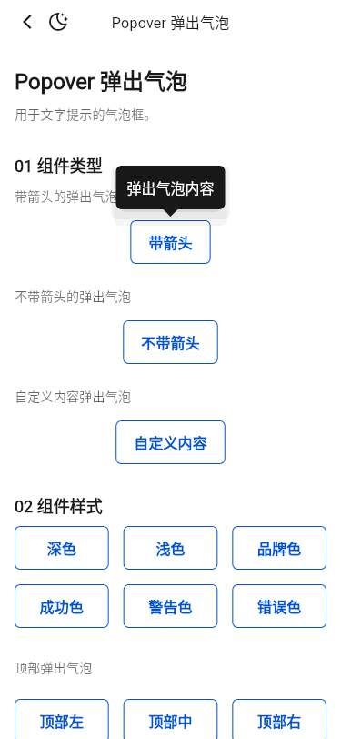
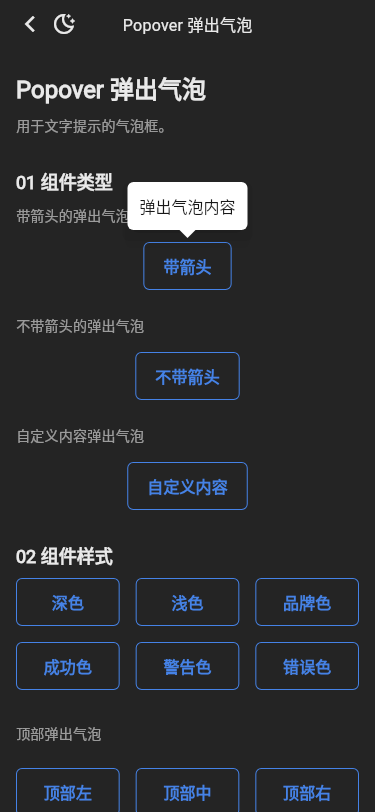

# Popover 截图比对

- 小程序基线：`tdesign-miniprogram@1.16.0`，提交 `ae55fb050b7a9474c33752b45b71c741f37ed872`。
- 小程序截图：微信开发者工具 RC 2.02.2607161，iPhone 12/13 (Pro) 模拟视口。
- Flutter 截图：Flutter 3.32.0 Linux，375dp、DPR 1、受控 CJK / Roboto / TIcons 字体。

| 小程序实际页 | Flutter 明亮 | Flutter 暗色 |
| --- | --- | --- |
|  |  |  |

结论：公开页的三个类型实例、六种主题与十二种 placement 顺序一致。Flutter 专用的交互/边界诊断场景保留在 Example 页内部测试模式，不扩展 TPopover 公开 API。

## 展开态复核

| 小程序 01「带箭头」展开 | Flutter 明亮展开 Golden | Flutter 暗色展开 Golden |
| --- | --- | --- |
|  |  |  |

- 微信开发者工具以 390×844、DPR 3 运行固定基线，并实际打开、截取、逐张检查了 21 个公开 Demo 的展开态；不是仅依据 WXML/API 推断。
- 小程序源码的 21 个公开触发器均声明 `t-button size="large"`；Flutter 已统一为 `TButtonSize.large`。
- 小程序右侧/左侧六个按钮使用 `446rpx` 固定宽度；Flutter 对应组合使用 223dp，并保持右侧组左对齐、左侧组右对齐。
- 自定义内容沿用小程序的 3 个 48dp 菜单项、两条 1dp 无间距分隔线，总高度 146dp。
- 右侧与左侧六种 placement 使用小程序示例的“气泡内容”，其余文本气泡使用“弹出气泡内容”。
- Flutter 为 3 个类型、6 种配色、12 种 placement 分别固定 light/dark 展开态，共 42 张 Golden；每张均断言 Overlay、气泡组件和内容真实可见后再截图。
- 42 张 Golden 已逐张与小程序展开态复核，气泡内容、箭头方向、触发锚点、按钮尺寸/宽度和视口边界均正常；平台导航栏与页面滚动壳按 Flutter / 小程序原生形态保留。

API 结论：合并 `develop@fb26b8d5` 后，实例 `colorScheme` 已是配色选择的唯一入口，`TPopoverThemeData` 仅保留具体样式值。Flutter 的 `contentWidget`、Overlay 关闭策略和 Future 生命周期属于平台原生组合能力，公开 Demo 不需要新增或删除 API。
