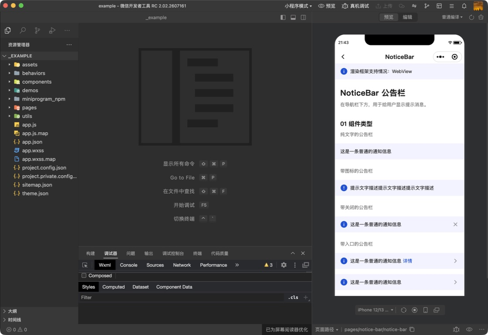
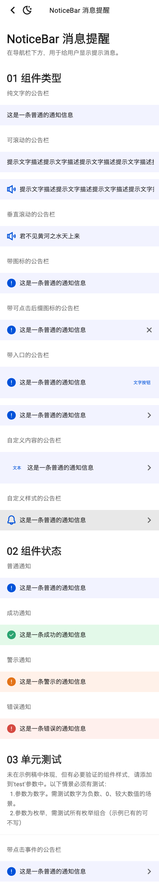
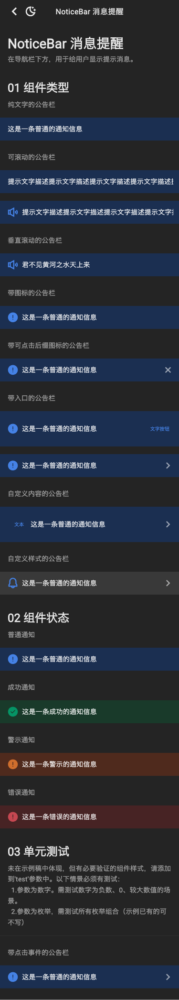

# 运行截图比对

基线：`tdesign-miniprogram@1.16.0`（`ae55fb050b7a9474c33752b45b71c741f37ed872`），统一使用 375dp 宽视口。Flutter 截图覆盖公开页面 light/dark；系统导航栏和字体栅格属于平台合理差异。

| 小程序公开页面 | Flutter light | Flutter dark |
| --- | --- | --- |
|  |  |  |

人工核对结论：组件类型、组件状态、公告栏顺序、图标/入口/自定义内容层级与小程序公开 Demo 对齐；Flutter 不新增 interval、operation 等尚未形成跨端契约的公共 API。静态截图不证明 marquee 帧级平滑度和垂直触摸循环，这些仍保留为未验证项。
