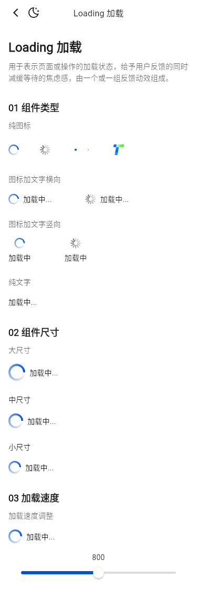
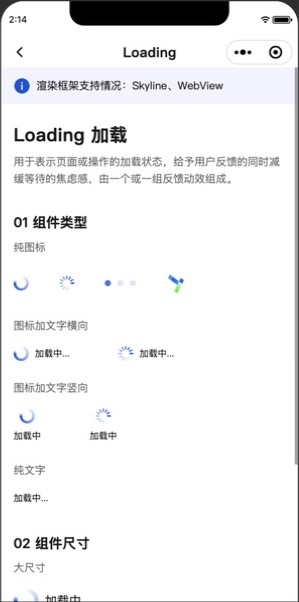
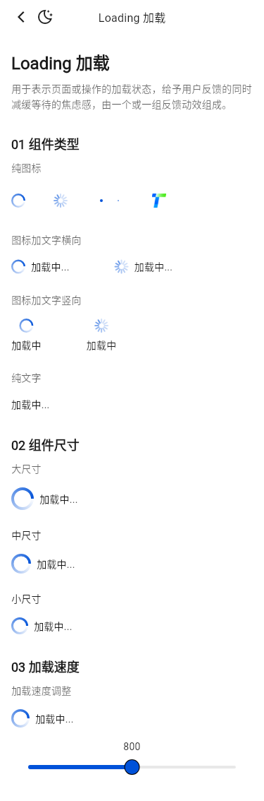
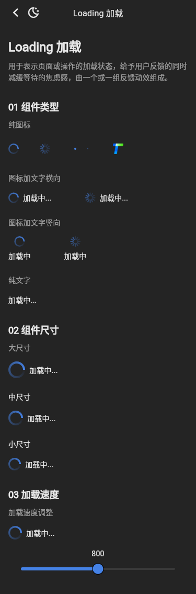

# Loading 截图比对

## 2026-09-15 Issue #1027 差异标记

| 修复前 | 修复后 | 像素差异 |
| --- | --- | --- |
|  |  |  |

浅色差异共 704px（0.17%），只落在纯图标、横向图文、竖向图文的 3 个 activity 指示器。circle、point、custom、文字、间距、尺寸和速度区域均未变化。该结果来自组件默认 Token 修复，Demo 没有注入黑色样式。

- 小程序基线：`tdesign-miniprogram@1.16.0`，提交 `ae55fb050b7a9474c33752b45b71c741f37ed872`。
- 小程序截图：微信开发者工具 RC 2.02.2607161，iOS 模拟视口。
- Flutter 截图：Flutter 3.32.0 Linux，375dp、DPR 1、受控 CJK / Roboto / TIcons 字体。

| 小程序实际页 | Flutter 明亮 | Flutter 暗色 |
| --- | --- | --- |
|  |  |  |

结论：公开页的三个分组、左对齐布局、纯图标四种指示器、横竖文字、三档尺寸与速度调整顺序一致；custom 指示器使用小程序 Demo 同一张 `logo2.png` 本地资产，速度滑块常驻显示 800 且交互后更新。Flutter 保留框架原生布局与字体差异，本轮未新增公开 API。
