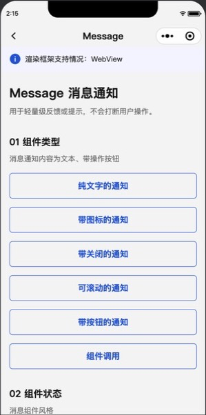
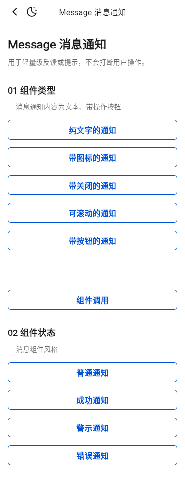
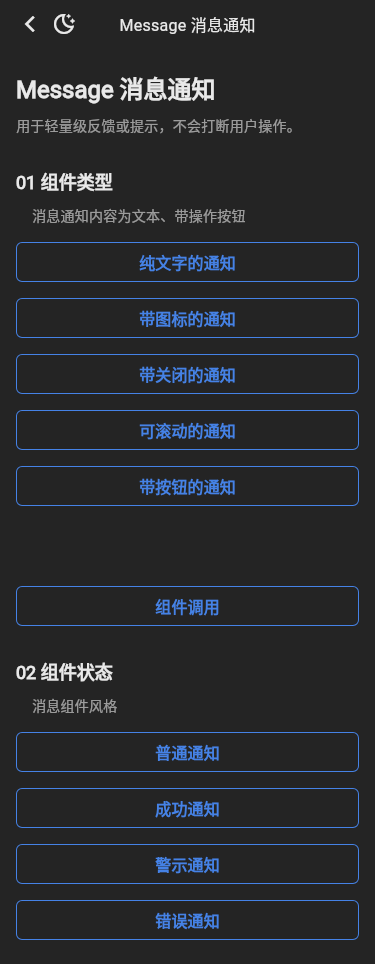

# Message 截图比对

- 小程序基线：`tdesign-miniprogram@1.16.0`，提交 `ae55fb050b7a9474c33752b45b71c741f37ed872`。
- 小程序截图：微信开发者工具 RC 2.02.2607161，iPhone 12/13 (Pro) 模拟视口。
- Flutter 截图：Flutter 3.32.0 Linux，375dp、DPR 1、受控 CJK / Roboto / TIcons 字体。

| 小程序实际页 | Flutter 明亮 | Flutter 暗色 |
| --- | --- | --- |
|  |  |  |

结论：公开页仅保留“组件类型”和“组件状态”，六个类型触发项与四个状态触发项顺序一致。“关闭所有通知”不是小程序公开矩阵，已从 Flutter 公开页移除，未新增公开 API。
