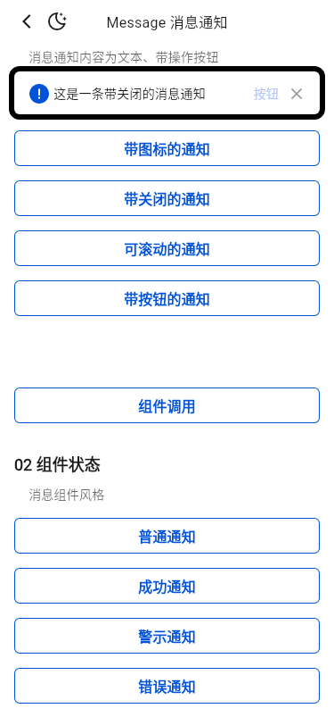
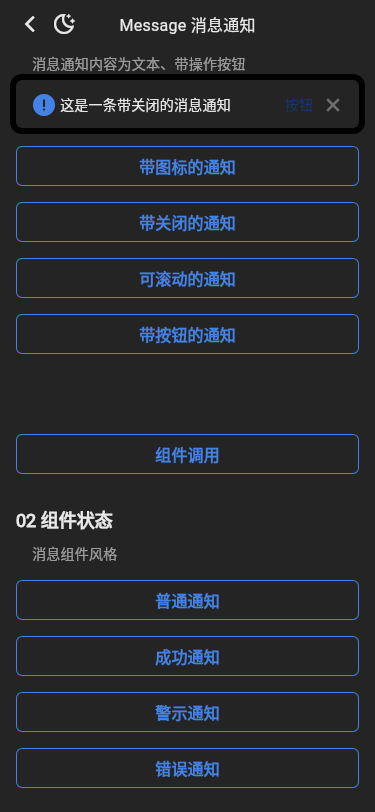
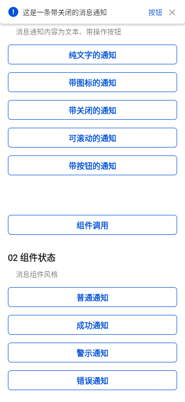
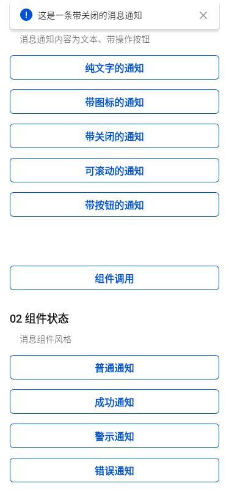

# Message 截图比对

- 小程序基线：`tdesign-miniprogram@1.16.0`，提交 `ae55fb050b7a9474c33752b45b71c741f37ed872`。
- 小程序截图：微信开发者工具 RC 2.02.2607161，iOS 模拟视口。
- Flutter 截图：Flutter 3.32.0 Linux，375dp、DPR 1、受控 CJK / Roboto / TIcons 字体。

| 场景 | 小程序 | Flutter 明亮 | Flutter 暗色 |
| --- | --- | --- | --- |
| 公开 Demo 页面 |  |  |  |
| 带关闭通知展示态 |  |  |  |

结论：公开页仅保留“组件类型”和“组件状态”，六个类型触发项与四个状态触发项顺序一致。“关闭所有通知”不是小程序公开矩阵，已从 Flutter 公开页移除，未新增公开 API。带关闭通知的截图在点击入口、Overlay 实际展示后采集，覆盖图标、文案、按钮和关闭图标间距。

## 2026-09-15 Issue #1027 标记差异

| 修复前 | 修复后 | 差异标记 |
| --- | --- | --- |
|  |  |  |

- **组件差异**：消息条从安全可视区域全宽改为左右各保留 16px 外边距。
- **Demo 差异**：“带关闭的通知”移除右侧多余的操作按钮，只保留关闭图标。
- 代表性 `message_closeable_opened_light` Golden：3,366px（1.11%）发生变化；差异图中的边界变化与按钮区域分别对应上述两项。
