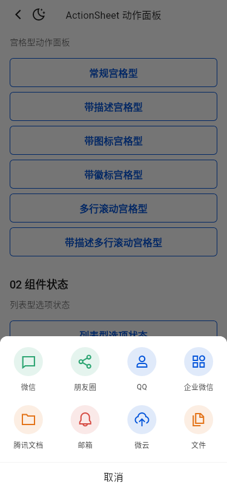
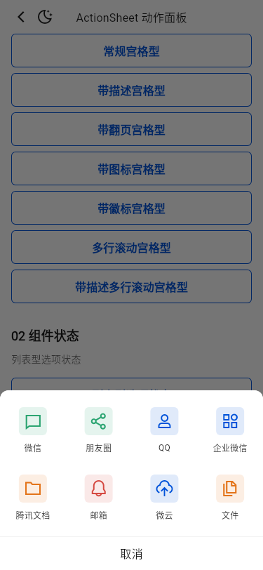
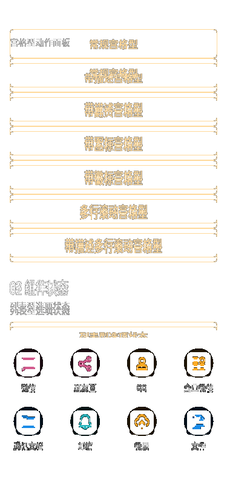

# 运行截图比对

基线：`tdesign-miniprogram@1.16.0`（`ae55fb050b7a9474c33752b45b71c741f37ed872`），统一使用 375dp 宽视口。Flutter 截图来自本 PR Demo 的 light/dark 页面与列表弹层；系统导航栏、宿主字体栅格属于平台合理差异，不作为组件 API 对齐依据。

| 场景 | 小程序 | Flutter light | Flutter dark |
| --- | --- | --- | --- |
| 公开 Demo 页面 |  |  |  |
| 常规列表弹层 |  |  |  |

人工核对结论：公开分组、九个入口、列表项顺序、禁用/强调状态和弹层内容层级一致；Flutter 继续使用本地 TDesign 图标与平台字体，不新增跨端 props。上述运行截图用于跨端人工验收，CI 中另以固定 CJK 字体的 light/dark 页面 Golden 锁定 Flutter 视觉回归。

## Issue #1027 像素修复

基线为 `origin/develop@b8a4bec7d`，截图均来自 CI 同款 Linux amd64 / Flutter 3.32.0 / 375×812 / DPR 1 环境。旧 Golden 与新渲染直接比较得到 `11.97%` 像素差异；确认差异后才更新基线，并在无 `--update-goldens` 参数下复跑。

| 修改前 Golden | 修改后渲染 | 标记差异 |
| --- | --- | --- |
|  |  |  |

差异项：

1. **Demo 问题**：补充“带翻页宫格型”入口，打开后显示三页指示器并支持真实 `PageView` 翻页。
2. **组件问题**：宫格默认图标槽位由 48dp 修正为 40dp；96dp Item 内按设计稿从顶部 16dp 开始排布。
3. **组件问题**：描述栏补齐 12dp 下内边距，描述文字到首行图标容器为 28dp，弹层总高为 294dp。
4. **Demo 内容问题**：“带图标宫格型”使用 40×40dp、6dp 圆角、`bgColorSecondaryContainer`（浅色为 `#F3F3F3`）容器；该容器是 `TActionSheetItem.icon` 的业务内容，没有在 ActionSheet 外层覆盖组件默认布局。

新增的描述宫格、带图标宫格和分页宫格均有独立 light/dark 打开态 Golden；最终 Linux Golden 18/18 无更新参数复跑通过。
