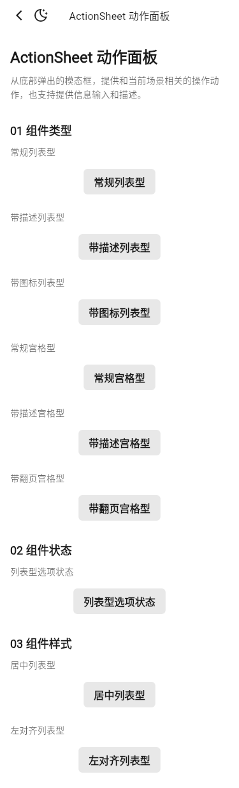
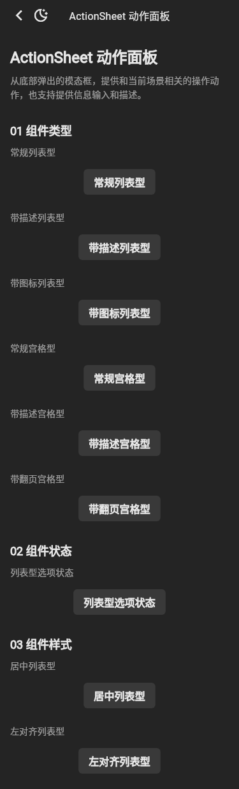
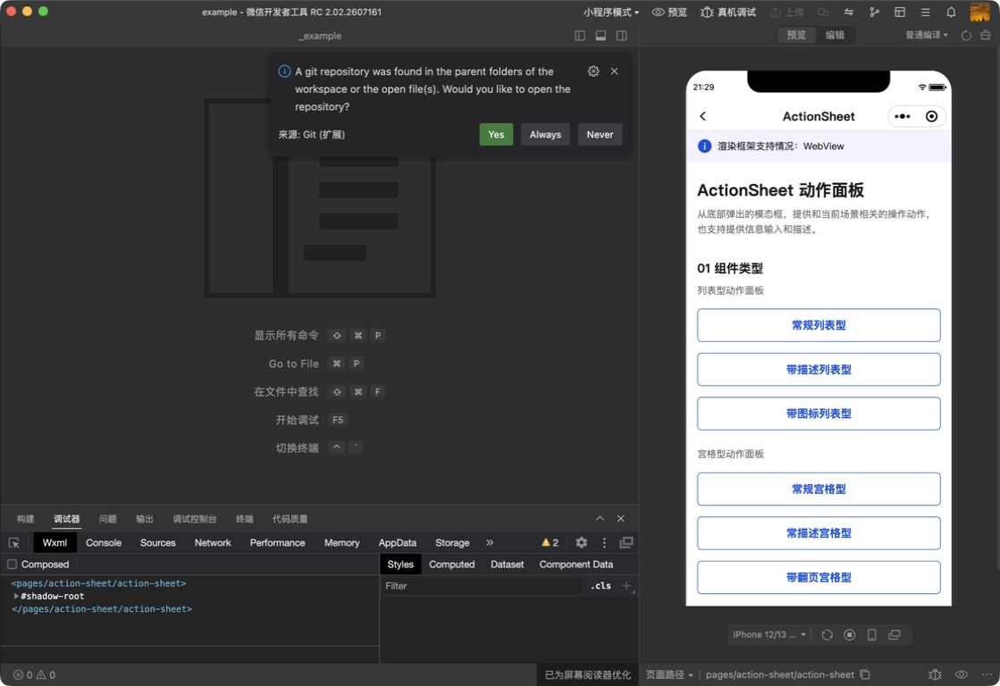
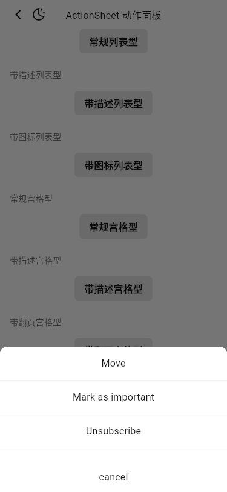
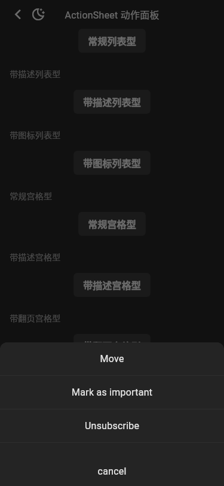

# 运行截图比对

基线：`tdesign-miniprogram@1.16.0`（`ae55fb050b7a9474c33752b45b71c741f37ed872`），统一使用 375dp 宽视口。Flutter 截图来自本 PR Demo 的 light/dark 页面与列表弹层；系统导航栏、宿主字体栅格属于平台合理差异，不作为组件 API 对齐依据。

| 场景 | 小程序 | Flutter light | Flutter dark |
| --- | --- | --- | --- |
| 公开 Demo 页面 |  |  |  |
| 常规列表弹层 |  |  |  |

人工核对结论：公开分组、九个入口、列表项顺序、禁用/强调状态和弹层内容层级一致；Flutter 继续使用本地 TDesign 图标与平台字体，不新增跨端 props。上述运行截图用于跨端人工验收，CI 中另以固定 CJK 字体的 light/dark 页面 Golden 锁定 Flutter 视觉回归。
