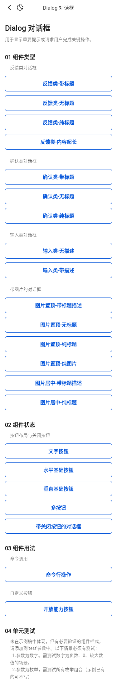
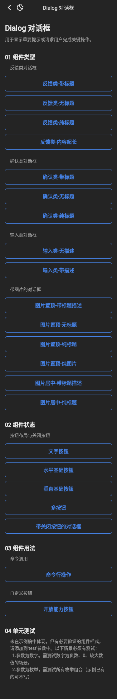
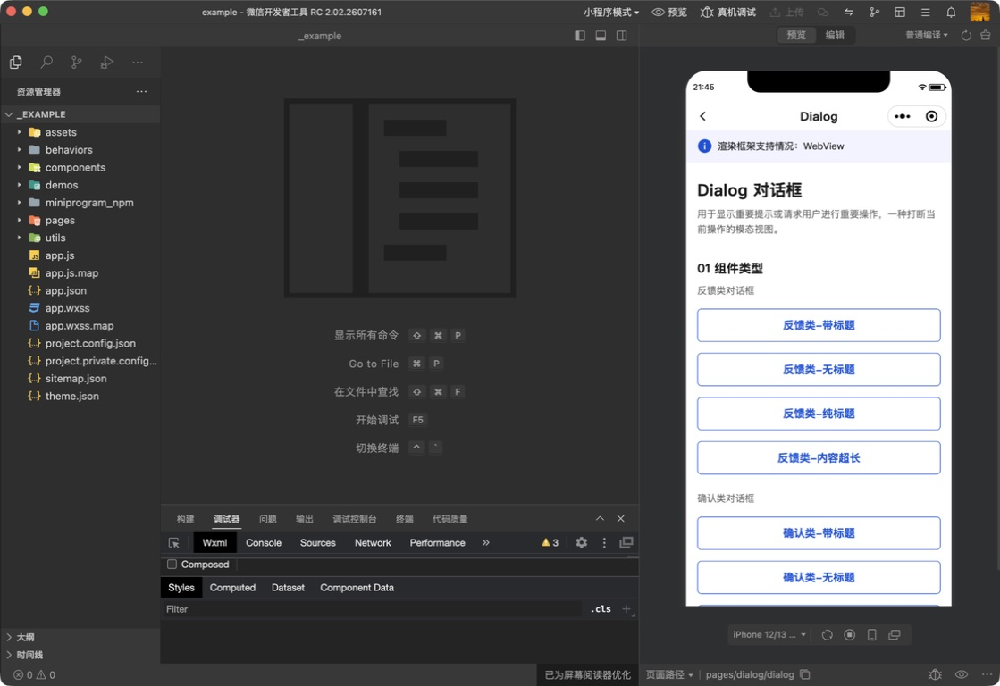
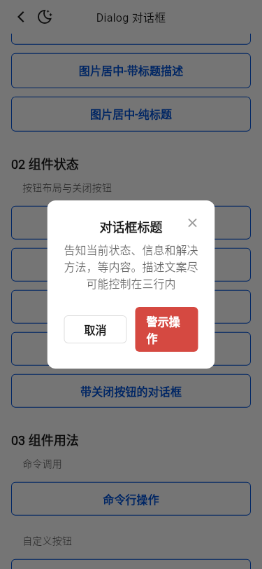
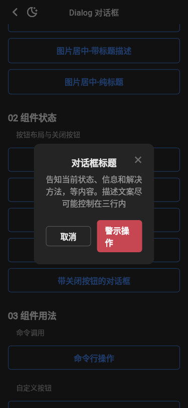

# 运行截图比对

基线：`tdesign-miniprogram@1.16.0`（`ae55fb050b7a9474c33752b45b71c741f37ed872`），统一使用 375dp 宽视口。Flutter 截图覆盖公开页面和带关闭按钮弹层的 light/dark；系统导航栏、宿主字体和原生输入控件属于平台合理差异。

| 场景 | 小程序 | Flutter light | Flutter dark |
| --- | --- | --- | --- |
| 公开 Demo 页面 |  |  |  |
| 对话框打开态 |  |  |  |

人工核对结论：三组场景、22 个入口、默认顶边距和关闭按钮位置符合公开 Demo 视觉基线；图片、输入和开放能力按钮继续通过 Flutter Widget / `TDialogAction` 组合表达，没有新增跨端专用公共 API。截图证明页面与关键打开态布局，不替代 22 个入口的逐项输入、返回值和连续交互验收。
