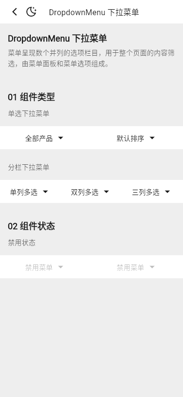
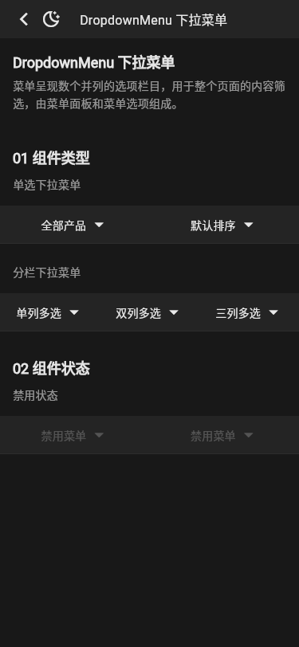
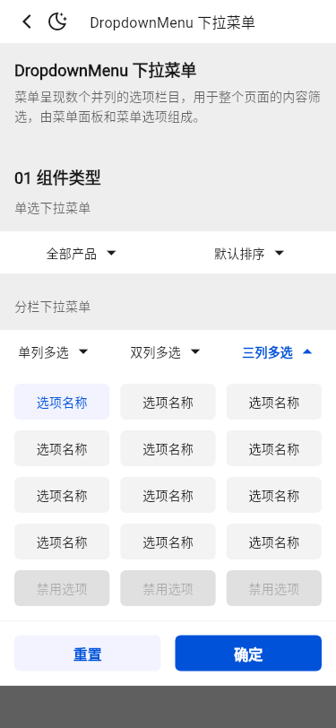
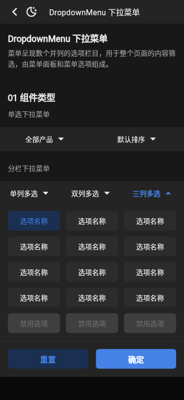

# 运行截图比对

基线：`tdesign-miniprogram@1.16.0`（`ae55fb050b7a9474c33752b45b71c741f37ed872`），统一使用 375dp 宽视口。Flutter 截图覆盖公开页面 light/dark；系统导航栏和字体栅格属于平台合理差异。

| 场景 | 小程序 | Flutter light | Flutter dark |
| --- | --- | --- | --- |
| 公开 Demo 页面 |  |  |  |
| 单选菜单展开态 |  |  |  |
| Figma 对齐后的公开 Demo 页面 | [Figma 节点](https://www.figma.com/design/jivYXTMTP3jEkeZXWbMh4J/branch/4SdclZkcv5bPgX6pa8AsmI/TDesign-for-mobile?node-id=24386-5279) |  |  |
| 三列多选展开态 | [Figma 节点](https://www.figma.com/design/jivYXTMTP3jEkeZXWbMh4J/branch/4SdclZkcv5bPgX6pa8AsmI/TDesign-for-mobile?node-id=24386-5279) |  |  |

人工核对结论：组件类型已收敛为“全部产品 + 默认排序”和同栏 1/2/3 列多选，组件状态为两个禁用菜单，且页面在该分组后结束，与小程序公开 Demo 一致。自定义面板、向上展开等 Flutter 能力不再混入公开矩阵，仍由组件聚焦测试保护；未新增或删除公共 API。单选展开态由点击触发后截图，禁用交互另由 Widget 测试验证。

Figma 复核结论：选中项勾选图标已使用 TDesign 图标并固定在 24px 尾部槽位；菜单栏和选项面板共用锚点定位，滚动时保持同位移；三列多选的 16px 外边距、12px 行列间距、40px 选项高度、6px 圆角和 72px 操作区均与设计 token 对齐。明暗态基线均由 Flutter 3.32.0 Linux 生成并严格复跑。
