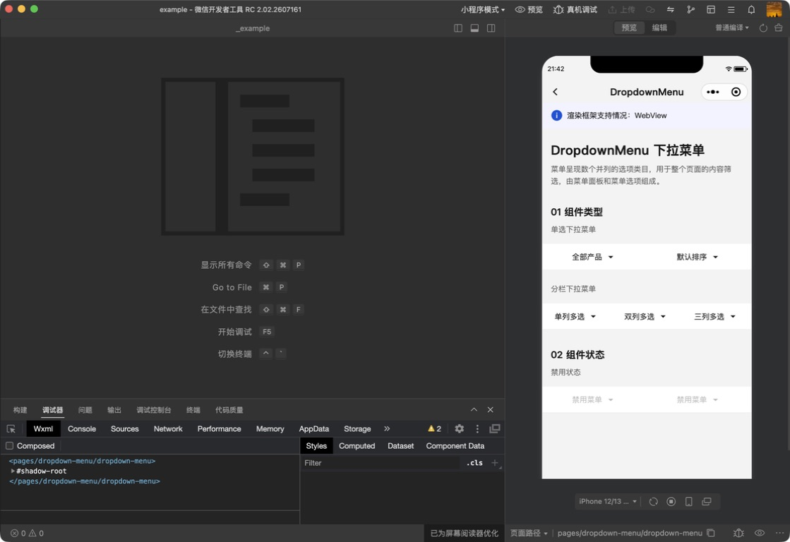
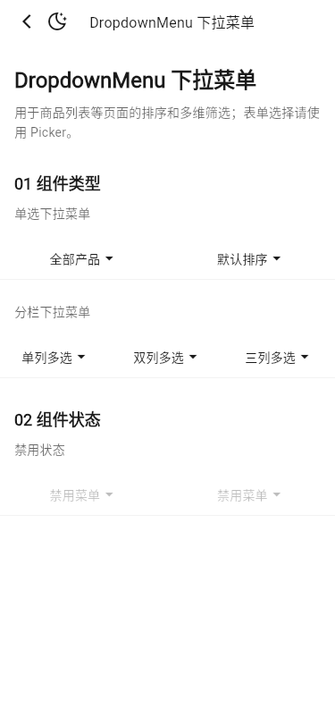
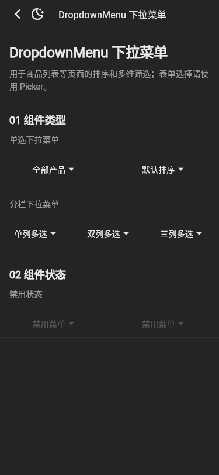
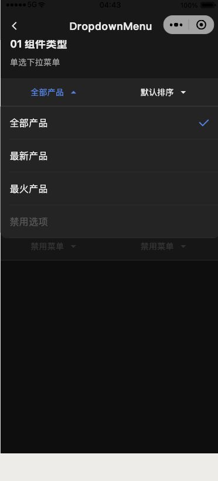
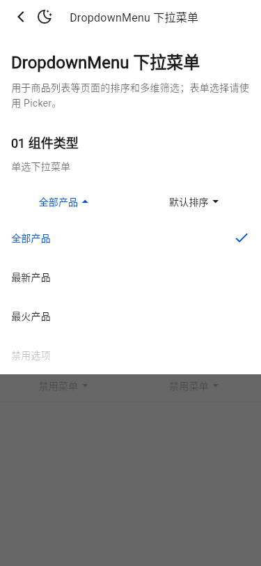
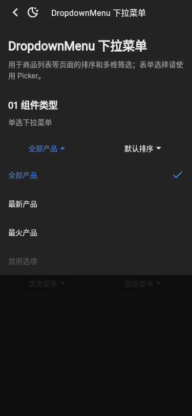

# 运行截图比对

基线：`tdesign-miniprogram@1.16.0`（`ae55fb050b7a9474c33752b45b71c741f37ed872`），统一使用 375dp 宽视口。Flutter 截图覆盖公开页面 light/dark；系统导航栏和字体栅格属于平台合理差异。

| 场景 | 小程序 | Flutter light | Flutter dark |
| --- | --- | --- | --- |
| 公开 Demo 页面 |  |  |  |
| 单选菜单展开态 |  |  |  |

人工核对结论：组件类型已收敛为“全部产品 + 默认排序”和同栏 1/2/3 列多选，组件状态为两个禁用菜单，且页面在该分组后结束，与小程序公开 Demo 一致。自定义面板、向上展开等 Flutter 能力不再混入公开矩阵，仍由组件聚焦测试保护；未新增或删除公共 API。单选展开态由点击触发后截图，禁用交互另由 Widget 测试验证。
