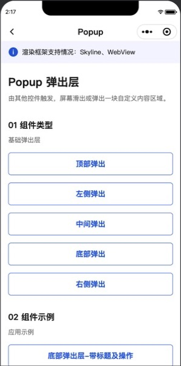
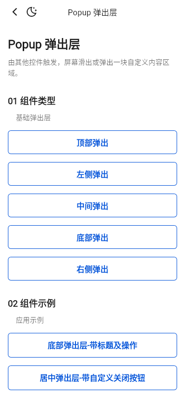
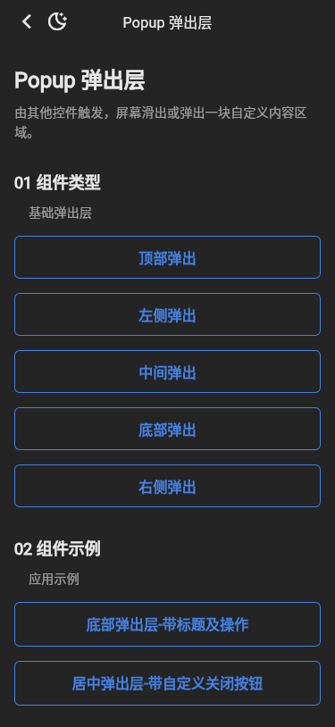

# Popup 截图比对

- 小程序基线：`tdesign-miniprogram@1.16.0`，提交 `ae55fb050b7a9474c33752b45b71c741f37ed872`。
- 小程序截图：微信开发者工具 RC 2.02.2607161，iPhone 12/13 (Pro) 模拟视口。
- Flutter 截图：Flutter 3.32.0 Linux，375dp、DPR 1、受控 CJK / Roboto / TIcons 字体。

| 小程序实际页 | Flutter 明亮 | Flutter 暗色 |
| --- | --- | --- |
|  |  |  |

结论：两个公开分组、五个基础弹出方向与两个应用实例顺序一致。现有 Flutter Popup API 已能表达该基线，本轮不新增公开 API。
