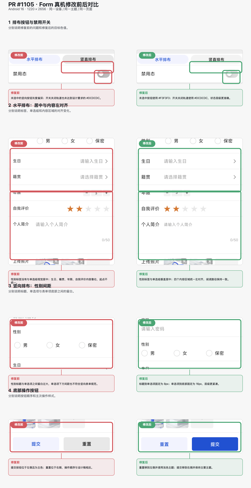
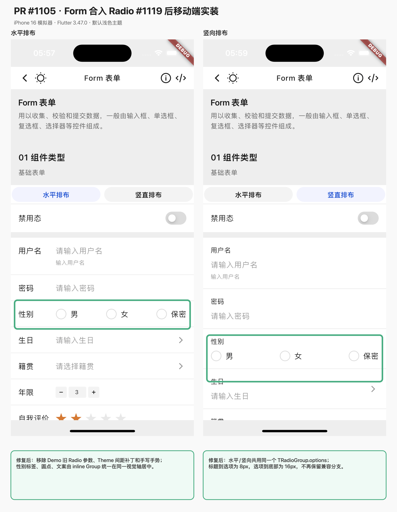

# 验收记录

## 验证环境

- 分支：`rss1102/fix/form-design-details`
- 基线：`origin/develop@d3ae100b0`（包含 #1119、#1120 与 #1121）
- Flutter/Dart：Flutter 3.32.0（FVM）、Flutter 3.47.0 / Dart 3.13.0

## 自动化验证

| 命令 | 结果 | 备注 |
| --- | --- | --- |
| `flutter test --no-pub test/components/form/t_form_test.dart` | 通过 | 49 tests |
| `flutter test --no-pub --exclude-tags golden test/form_demo_test.dart` | 通过 | 8 tests；覆盖默认值、提交反馈、完整重置、inline Radio、交互、对齐、间距、按钮样式和 Picker 弹层高度 |
| `dart run tool/generate_example_code.dart --check` | 通过 | 示例代码与源码一致 |
| Linux 3.32.0：`flutter test --no-pub test/form_demo_test.dart` | 等待远端 CI | 正常态视觉未随本轮提交反馈改动变化；最终结论以当前 Head 的 Linux visual regression 为准 |
| `flutter analyze --fatal-infos` | 通过 | 组件包与 example 均为 0 issues |
| `flutter build apk --debug` | 通过 | Android Debug APK 构建成功 |
| Flutter 3.47.0：Form 组件 / Demo 非 Golden 测试 | 通过 | 组件生产源码未变；Demo 8 tests 通过 |
| Flutter 3.47.0：`flutter analyze --fatal-infos` | 通过 | 组件包与 example 均为 0 issues |

## 人工验收

- [x] Figma 桌面端确认正确设计节点为 `41936:17938`，画板尺寸 375 × 1254、背景 `#F6F6F6`
- [x] iPhone 16 模拟器运行移动端集成测试并采集水平、竖向和禁用态截图
- [x] Android 16 真机（1220 × 2656）安装并运行最终源码，水平、竖向、禁用态和提交成功集成流程通过

### 原 Form 修复的 Android 真机修改前后对比

- 设备：Android 16，物理分辨率 1220 × 2656
- 修改前：`origin/develop@c2f9ef5e8`
- 修改后：#1119 合入前的 Form 修复提交；用于核对本 PR 其余四类视觉变更
- 条件：同一设备、默认浅色主题、同一 Form Demo 页面

### 合入 #1119 后的移动端实装核对

- 环境：iPhone 16 模拟器，Flutter 3.47.0，默认浅色主题
- 水平与竖向均使用同一个 `TRadioGroup.options` 和 `TRadioVariant.inline`
- 截图外部标注说明了移除旧参数、Theme 间距补丁、手写手势和兼容分支的原因

## 正常态设计基准

- 用户名：`Abcdefgh`；密码：8 位掩码；性别：默认选中“男”。
- 生日：`2022-08-10`；籍贯：`广东省 深圳市`；年限：`3`；评分：`3.5`。
- 个人简介使用设计稿 50 字文案，显示 `50/50` 且不发生 RenderFlex 溢出。
- 两张上传图片使用相同示例图；开关默认关闭；用户名下方不显示默认 tips。
- 排布标题为“竖向排布”。

## 未覆盖项与后续工作

- 按维护要求不在仓库或本地保留新的 Figma/真机对比附件；正确节点、当前实现与逐项修改原因已直接发布到 [PR 对比评论](https://github.com/Tencent/tdesign-flutter/pull/1105#issuecomment-5661594048)。
- Figma 与 Android 的系统字体栅格、设备像素比和页面壳不同，直接截图用于逐项布局核对，不将跨平台截图表述为逐像素零差异。
