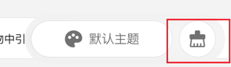
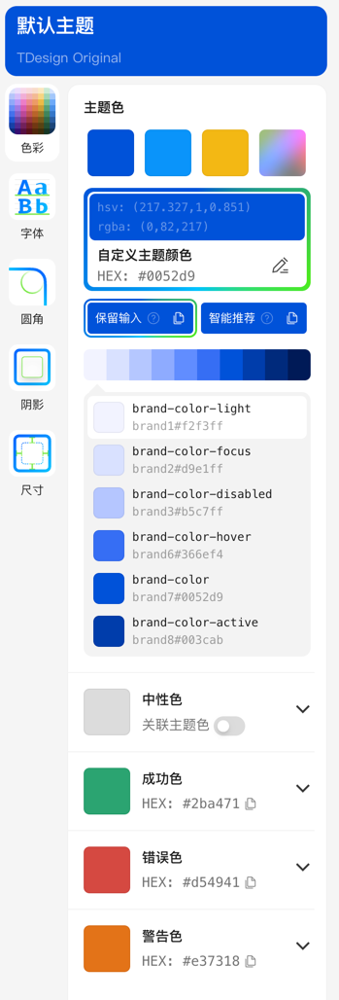
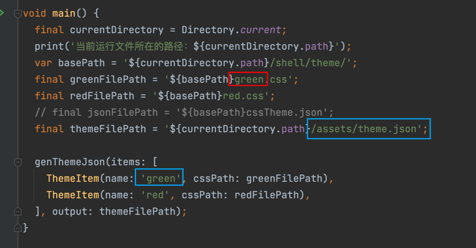

<p align="center">
  <a href="https://tdesign.tencent.com/" target="_blank">
    
  </a>
</p>
腾讯TDesign Flutter技术栈组件库，适合在移动端项目中使用。

# 特性

- 提供TDesign设计风格的Flutter UI组件库
- 支持根据App设计风格定制主题
- 提供常用Icon库，支持定制替换
- 根据TDesign规范定义颜色组，可在TDColors中查看，方便适配TDesign规范的组件
- 色值声明类可以添加默认颜色，实时查看色值默认显示效果

# 使用方法
- 在pubbspec.yaml引入依赖。

```yaml
  dependencies:
    tdesign_flutter: ^0.0.6
```

- 在文件头部引入：`import 'package:tdesign_flutter/tdesign_flutter.dart'; // 组件库相关的，只需要引入这个文件，里面暴露td前缀所有需要的类`
- 可通过json文件配置颜色/字体尺寸/字体样式/圆角/阴影等主题样式。通过TDTheme.of(context)或者TDTheme.defaultData()获取主题数据。建议组件都使用TDTheme.of(context)的，不需要跟随局部主题的组件，才可以使用TDTheme.defaultData()。
    
    颜色，字体，圆角等使用示例：
```
    TDTheme.of(context).brandNormalColor
    TDTheme.defaultData().fontBodyLarge
```
- TDesign的Icon不跟随主题，都是ttf格式,使用示例：
```
    Icon(TDIcons.activity)
```
    
- 使用示例：`example/lib/page/`

# 自定义主题

## 基础用法
设置自定义主题的方式:
```
    MaterialApp(
      theme: ThemeData(
        extensions: [TDThemeData.fromJson('test', testThemeConfig)!],
      )
      ……
    )
```
自定义主题属性,常用可设置属性键值请参考[td_default_theme.dart](lib/src/theme/td_default_theme.dart):
```
    String testThemeConfig = '''
      {
        "test": {
            "color": {
                "brandNormalColor": "#D7B386"
            },
            "font": {
                "fontBodyMedium": {
                    "size": 40,
                    "lineHeight": 55
                }
            }
        }
    }
  ''';
```

## 主题生成器
如果你不想自定义太多颜色,但是想要拥有好看的自定义主题,"主题生成器"是个不错的选择.

1.进入[TDesign官网](https://tdesign.tencent.com/vue/custom-theme) ,点击下方的主题生成器,然后再右边生成器里选择想要的颜色,点击下载





2.此时你得到是一个theme.css文件,可以将该文件放到tdesign-component/example/shell/theme/文件夹下,把该文件夹下的css2JsonTheme.dart修改为你自己的文件名、主题名和输出路径,即可得到一个theme.json文件


3.将主题json加载进TDTheme,美观的自定义主题就设置完成了.
```
    var jsonString = await rootBundle.loadString('assets/theme.json');
    var _themeData = TDThemeData.fromJson('green', jsonString);
    // ……
    MaterialApp(
      title: 'TDesign Flutter Example',
      theme: ThemeData(
      extensions: [_themeData],
      home: MyHomePage(title: 'TDesign Flutter 组件库'),
    );
```

# 开发规范
- 组件命名规范：以TD为前缀，组件名称、API名称参考TDesign现有组件和API命名，可以根据flutter原生Widget的特点进行修改。组件API以满足设计要求和使用为准，可根据flutter特点做精简或定制。
- 组件库用到的所有色值、圆角、字体字号等样式属性需全部定义在主题中。
- 代码规范遵循腾讯Dart代码规范。
- 对于系统原有组件，如Text,Image等，应兼容系统原组件功能，只能扩展，不能阉割，以免业务需要使用系统功能时，必须放弃TDesign控件。
- 示例页面尽量使用ExamplePage+ExampleModule+ExampleItem组合，按照示例稿的布局实现；页面写完后，在main.dart中修改exampleMap对应组件的isTodo属性即可。
- 组件API和演示代码，请参考`demo_tool/README.md`文件。

# 共建流程
- 拉取开发分支：建议将项目fork到自己github,每个组件从main分支拉取对应开发分支，命名为feature/组件名小写_下划线
- 实现组件：组件中的属性请尽量使用TDTheme提供的公共属性，使用方法参考'主题-颜色'页面
- 编写示例页：示例页请尽量使用ExamplePage+ExampleModule+ExampleItem组合，参考示例稿布局实现。
- 演示代码：每个组件示例，尽量将原子性代码提取成独立方法，并添加@Demo注解，方便生成演示代码。其中，@Demo注解的'group'参数需与ExamplePage的'exampleCodeGroup'参数一致。写法请参考'圆角-基础'页。
- flutterAOP: 如果可以，建议切换到flutter 3.10.0分支，并添加AOP补丁，生成演示代码。
- API文档：API文档由工具统一生成，请尽量添加字段的详细注释，并将构造方法作为类名下的第一个方法，字段放在构造方法之下，具体写法请参考TDText。
- 代码规范：开发完成后，请检查'Dart Analysis'下的提示，尽量符合代码规范。
- 单元测试：添加未在示例稿中体现，但有必要验证的组件样式，请添加到ExamplePage的'test'参数中。
- 合并代码: 上述检查完成后，请发起pr，合并到dev分支，并同步项目组验收。

## 常见问题

- Flutter 3.16之后,修改了渲染引擎,导致启用forceVerticalCenter参数的组件字体偏移更多,不再居中.可以通过设置kTextForceVerticalCenterEnable=false来禁用字体居中功能,让组件显示与官方Text一致


# SDK依赖版本
dart: ">=2.19.0 <4.0.0"

flutter: ">=3.7.0"

# 其他技术栈实现
- 桌面端 Vue 3 实现：[web-vue-next](https://github.com/Tencent/tdesign-vue-next)
- 桌面端 React 实现： [web-react](https://github.com/Tencent/tdesign-react)
- 移动端小程序实现： [小程序](https://github.com/Tencent/tdesign-miniprogram)

# 交流反馈

 


# 开源协议

TDesign 遵循 [MIT 协议](https://github.com/Tencent/tdesing-flutter/blob/main/tdesign-component/LICENSE)

# 致谢
TDesign Flutter 依赖以下组件库,感谢作者的开源贡献:

[flutter_easyrefresh](https://pub-web.flutter-io.cn/packages/easy_refresh)

[flutter_swiper](https://pub-web.flutter-io.cn/packages/flutter_swiper)