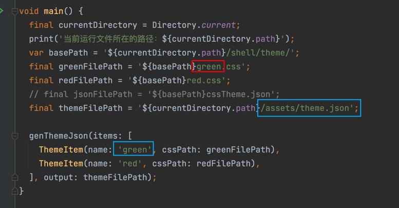
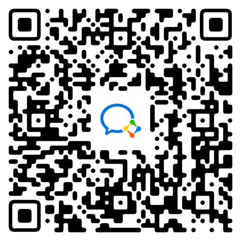

<p align="center">
  <a href="https://tdesign.tencent.com/" target="_blank">
    
  </a>
</p>

腾讯 TDesign Flutter 技术栈组件库，适合在移动端项目中使用。

# 特性

- 提供 TDesign 设计风格的 Flutter UI 组件库
- 支持根据 App 设计风格定制主题
- 提供常用 Icon 库，支持定制替换
- 根据 TDesign 规范定义颜色组，可在 TDColors 中查看，方便适配 TDesign 规范的组件
- 色值声明类可以添加默认颜色，实时查看色值默认显示效果

# 使用方法

- 在 pubbspec.yaml 引入依赖。

```yaml
dependencies:
  tdesign_flutter: ^0.0.6
```

- 在文件头部引入：`import 'package:tdesign_flutter/tdesign_flutter.dart'; // 组件库相关的，只需要引入这个文件，里面暴露td前缀所有需要的类`
- 可通过 json 文件配置颜色/字体尺寸/字体样式/圆角/阴影等主题样式。通过 TDTheme.of(context)或者 TDTheme.defaultData()获取主题数据。建议组件都使用 TDTheme.of(context)的，不需要跟随局部主题的组件，才可以使用 TDTheme.defaultData()。
  颜色，字体，圆角等使用示例：

```
    TDTheme.of(context).brandNormalColor
    TDTheme.defaultData().fontBodyLarge
```

- TDesign 的 Icon 不跟随主题，都是 ttf 格式,使用示例：

```
    Icon(TDIcons.activity)
```

- 使用示例：`example/lib/page/`

# 自定义主题

## 基础用法

设置自定义主题的方式:

```
    MaterialApp(
      theme: ThemeData(
        extensions: [TDThemeData.fromJson('test', testThemeConfig)!],
      )
      ……
    )
```

自定义主题属性,常用可设置属性键值请参考[td_default_theme.dart](lib/src/theme/td_default_theme.dart):

```
    String testThemeConfig = '''
      {
        "test": {
            "color": {
                "brandNormalColor": "#D7B386"
            },
            "font": {
                "fontBodyMedium": {
                    "size": 40,
                    "lineHeight": 55
                }
            }
        }
    }
  ''';
```

## 主题生成器

如果你不想自定义太多颜色,但是想要拥有好看的自定义主题,"主题生成器"是个不错的选择.

1.进入[TDesign 官网](https://tdesign.tencent.com/vue/custom-theme) ,点击下方的主题生成器,然后再右边生成器里选择想要的颜色,点击下载


相关操作可以参考下方视频：

<video controls width="100%">
    <source src="https://tdesign.gtimg.com/site/theme/demo-cn.mp4" type="video/mp4" />
</video>


2.此时你得到是一个 theme.css 文件,可以将该文件放到 tdesign-component/example/shell/theme/文件夹下,把该文件夹下的 css2JsonTheme.dart 修改为你自己的文件名、主题名和输出路径,即可得到一个 theme.json 文件


3.将主题 json 加载进 TDTheme,美观的自定义主题就设置完成了.

```
    var jsonString = await rootBundle.loadString('assets/theme.json');
    var _themeData = TDThemeData.fromJson('green', jsonString);
    // ……
    MaterialApp(
      title: 'TDesign Flutter Example',
      theme: ThemeData(
        extensions: [_themeData]
      ),
      home: MyHomePage(title: 'TDesign Flutter 组件库'),
    );
```

# 国际化

TD 组件库内部不内置国际化语言,但支持与 flutter 的国际化能力搭配使用.可以继承 TDResourceDelegate 类,该类抽离了组件内部所有文字资源,重新获取文字的方法,进行国际化处理,并通过 TDTheme.setResourceBuilder 注入.
示例代码:

1. 重写 TDResourceDelegate 类:

```
/// 国际化资源代理
class IntlResourceDelegate extends TDResourceDelegate {
  IntlResourceDelegate(this.context);

  BuildContext context;

  /// 国际化需要每次更新context
  updateContext(BuildContext context){
    this.context = context;
  }

  @override
  String get cancel => AppLocalizations.of(context)!.cancel;

  @override
  String get confirm => AppLocalizations.of(context)!.confirm;

}
```

2.注入 TDResourceDelegate 类:

```
    var delegate = IntlResourceDelegate(context);
    return MaterialApp(
      home: Builder(
        builder: (context) {
          // 设置文案代理,国际化需要在MaterialApp初始化完成之后才生效,而且需要每次更新context
          TDTheme.setResourceBuilder((context) => delegate..updateContext(context), needAlwaysBuild: true);
          return MyHomePage(
            title: AppLocalizations.of(context)?.components ?? '',
          );
        },
      ),
      // 设置国际化处理
      locale: locale,
      supportedLocales: AppLocalizations.supportedLocales,
      localizationsDelegates: AppLocalizations.localizationsDelegates,
    );
```

3.flutter 国际化配置方法,官方文档:[Flutter 应用里的国际化](https://docs.flutter.cn/ui/accessibility-and-internationalization/internationalization)

# 开发规范

- 组件命名规范：以 TD 为前缀，组件名称、API 名称参考 TDesign 现有组件和 API 命名，可以根据 flutter 原生 Widget 的特点进行修改。组件 API 以满足设计要求和使用为准，可根据 flutter 特点做精简或定制。
- 组件库用到的所有色值、圆角、字体字号等样式属性需全部定义在主题中。
- 代码规范遵循腾讯 Dart 代码规范。
- 对于系统原有组件，如 Text,Image 等，应兼容系统原组件功能，只能扩展，不能阉割，以免业务需要使用系统功能时，必须放弃 TDesign 控件。
- 示例页面尽量使用 ExamplePage+ExampleModule+ExampleItem 组合，按照示例稿的布局实现；页面写完后，在 main.dart 中修改 exampleMap 对应组件的 isTodo 属性即可。
- 组件 API 和演示代码，请参考`demo_tool/README.md`文件。
- 组件内部的固定文案,都应该抽离到 TDResourceDelegate 中统一管理,方便业务进行国际化适配

# 共建流程

- 拉取开发分支：建议将项目 fork 到自己 github,每个组件从 main 分支拉取对应开发分支，命名为 feature/组件名小写\_下划线
- 实现组件：组件中的属性请尽量使用 TDTheme 提供的公共属性，使用方法参考'主题-颜色'页面
- 编写示例页：示例页请尽量使用 ExamplePage+ExampleModule+ExampleItem 组合，参考示例稿布局实现。
- 演示代码：每个组件示例，尽量将原子性代码提取成独立方法，并添加@Demo 注解，方便生成演示代码。其中，@Demo 注解的'group'参数需与 ExamplePage 的'exampleCodeGroup'参数一致。写法请参考'圆角-基础'页。
- flutterAOP: 如果可以，建议切换到 flutter 3.10.0 分支，并添加 AOP 补丁，生成演示代码。
- API 文档：API 文档由工具统一生成，请尽量添加字段的详细注释，并将构造方法作为类名下的第一个方法，字段放在构造方法之下，具体写法请参考 TDText。
- 代码规范：开发完成后，请检查'Dart Analysis'下的提示，尽量符合代码规范。
- 单元测试：添加未在示例稿中体现，但有必要验证的组件样式，请添加到 ExamplePage 的'test'参数中。
- 合并代码: 上述检查完成后，请发起 pr，合并到 dev 分支，并同步项目组验收。

## 常见问题

- 文本居中:

  > 0.1.4 版本:Flutter 3.16 之后,修改了渲染引擎,导致启用 forceVerticalCenter 参数的组件字体偏移更多,不再居中.可以通过设置 kTextForceVerticalCenterEnable=false 来禁用字体居中功能,让组件显示与官方 Text 一致
  >
  > 0.1.5 版本:适配了 Android 和 iOS 双端基础系统字体的中文居中,其他语言的字体,可以通过重写 TDTextPaddingConfig 的 paddingRate 和 paddingExtraRate 进行自定义适配,TDTextPaddingConfig 使用方法可参考 TDTextPage.

- 修改全局字体:
  > 设置 kTextNeedGlobalFontFamily=true,然后设置 TDTextConfiguration 的 globalFontFamily 参数.(0.1.6 版本开始支持)

# SDK 依赖版本

dart: ">=2.19.0 <4.0.0"

flutter: ">=3.7.0"

# 其他技术栈实现

- 桌面端 Vue 3 实现：[web-vue-next](https://github.com/Tencent/tdesign-vue-next)
- 桌面端 React 实现： [web-react](https://github.com/Tencent/tdesign-react)
- 移动端小程序实现： [小程序](https://github.com/Tencent/tdesign-miniprogram)

# 交流反馈

 

# 开源协议

TDesign 遵循 [MIT 协议](https://github.com/Tencent/tdesing-flutter/blob/main/tdesign-component/LICENSE)

# 致谢

TDesign Flutter 依赖以下组件库,感谢作者的开源贡献:

[flutter_easyrefresh](https://pub-web.flutter-io.cn/packages/easy_refresh)

[flutter_swiper](https://pub-web.flutter-io.cn/packages/flutter_swiper)

[flutter_slidable](https://pub-web.flutter-io.cn/packages/flutter_slidable)
